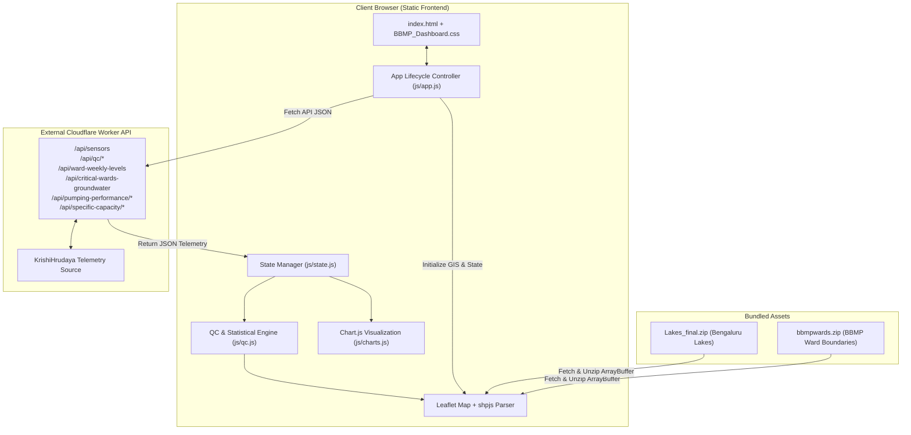

# Project Overview: BWSSB Borewell Dashboard

This document provides a comprehensive technical overview of the **BWSSB Borewell Dashboard** repository. It covers the system architecture, file structure, analytical lenses, data processing workflows, quality control pipelines, and deployment procedures.

---

## 1. Executive Summary

The **BWSSB Borewell Dashboard** is a client-side, single-page web application designed for interactive geospatial visualization, data quality assessment, and trend analysis of telemetry sensors fitted on municipal borewells across Bruhat Bengaluru Mahanagara Palike (BBMP) wards in Bengaluru, India.

Key operational capabilities:
- **Geospatial Analytics**: Interactive Leaflet basemap rendering 200+ BBMP ward boundaries (`bbmpwards.zip`) and Bengaluru lake bodies (`Lakes_final.zip`) with spatial point-in-polygon sensor matching performed client-side.
- **Multi-Lens Ward Classification**: Analytical lenses evaluating wards based on **Groundwater Decline** (Linear, Theil-Sen, and Mann-Kendall statistical trends), **High Extraction Volume**, **High Pumping Stress** (Drawdown per $m^3$), **Previous Consumption Criticality**, and **Low Specific Capacity**.
- **Quality Control (QC) Engine**: Automated scoring categorizing sensors into `GOOD`, `USABLE_WITH_CAUTION`, `POOR`, `INSUFFICIENT_DATA`, and `NO_DATA` based on reporting frequency, zero/flatline detection, and outlier analysis.
- **Pumping & Specific Capacity Diagnostics**: Calculation of transmissivity scaling, specific capacity ($m^2/s$), inverse specific capacity ($s/m^2$), and volume-normalized drawdown ($ft/m^3$).
- **Interactive Visualization & Export**: Time-series charts powered by Chart.js (with Hampel / rolling median outlier filter toggles, fullscreen expansions, and PNG export) and CSV/Excel exports for filtered sensors and ward metrics.

---

## 2. Architecture & Data Flow

The repository contains **frontend static assets only**. All background data scraping, KrishiHrudaya (KH) report downloads, database storage, and REST API routes are hosted on an external Cloudflare Worker API backend (`bbmp-borewell-api.vishwas-borewellworkersdev.workers.dev`).

### System Architecture Diagram



---

## 3. Directory & File Overview

| File / Path | Description |
| :--- | :--- |
| [`index.html`](file:///D:/bbmp-borewell-dashboard/index.html) | Main HTML document structuring the 3-column collapsible web layout (Left Sidebar Controls, Center Map Canvas, Right Analytics Panel) and external library CDN tags. |
| [`BBMP_Dashboard.css`](file:///D:/bbmp-borewell-dashboard/BBMP_Dashboard.css) | Custom styling system using CSS custom properties (variables), CSS grid/flexbox, collapsible layout modes, theme modifiers, map controls, and responsive chart containers. |
| [`favicon.png`](file:///D:/bbmp-borewell-dashboard/favicon.png) | IISc logo icon asset used in browser tabs and web application headers. |
| [`README.md`](file:///D:/bbmp-borewell-dashboard/README.md) | High-level repository documentation, live demo links, deployment instructions, and security guidelines. |
| [`LICENSE`](file:///D:/bbmp-borewell-dashboard/LICENSE) | Open-source MIT License text. |
| [`bbmpwards.zip`](file:///D:/bbmp-borewell-dashboard/bbmpwards.zip) | Bundled ESRI Shapefile archive containing BBMP ward polygons, parsed client-side using `shpjs`. |
| [`Lakes_final.zip`](file:///D:/bbmp-borewell-dashboard/Lakes_final.zip) | Bundled ESRI Shapefile archive containing Bengaluru lake geometries and names, overlaid on Leaflet. |
| [`js/config.js`](file:///D:/bbmp-borewell-dashboard/js/config.js) | Security URL sanitizer (SSRF protection for `?api=` parameter), API base endpoints, API version keys, and map center coordinates (`[12.9716, 77.5946]`). |
| [`js/state.js`](file:///D:/bbmp-borewell-dashboard/js/state.js) | Global state containers, cached API lookup maps (`Map` objects), active selection pointers, DOM element reference registry (`els`), and layout state flags. |
| [`js/utils.js`](file:///D:/bbmp-borewell-dashboard/js/utils.js) | Helper utilities for formatting numbers/dates, escaping HTML/CSV, point-in-polygon spatial calculations (`pointInFeature`), map popups, search filtering, toast notifications, CSV downloads, and fullscreen chart modals. |
| [`js/qc.js`](file:///D:/bbmp-borewell-dashboard/js/qc.js) | Core quality control scoring algorithms, statistical trend evaluation (Theil-Sen slopes, Mann-Kendall $p$-values, linear regression), and multi-lens ward criticality classification rules. |
| [`js/api.js`](file:///D:/bbmp-borewell-dashboard/js/api.js) | Asynchronous fetch service with retry logic, cache management, data normalization, and chart time-series outlier cleaning filters (Hampel filter & rolling median MAD). |
| [`js/charts.js`](file:///D:/bbmp-borewell-dashboard/js/charts.js) | Dynamic HTML panel builders for ward/sensor detail tabs and Chart.js initialization logic for water level, discharge, specific capacity, and pumping performance charts. |
| [`js/app.js`](file:///D:/bbmp-borewell-dashboard/js/app.js) | Main application entry point. Coordinates map rendering, GIS layer initialization, asynchronous data fetch pipeline execution, UI event handlers, sidebar toggles, and global exception handling. |

---

## 4. Key Functional Modules & Implementation Details

### 4.1 Security & API Sanitization ([`js/config.js`](file:///D:/bbmp-borewell-dashboard/js/config.js))
To prevent Server-Side Request Forgery (SSRF) and untrusted domain injection via URL parameters (e.g. `?api=http://malicious.domain`), `getValidApiBaseUrl()` validates custom `?api=` parameters against an allowlist:
- `localhost` / `127.0.0.1` / private IP ranges (`192.168.*`, `10.*`)
- Approved worker and pages origins (`*.workers.dev`, `*.github.io`)
- Secure HTTP protocols (`https:`, or `http:` for local development)

### 4.2 Spatial Point-in-Polygon Matching ([`js/utils.js`](file:///D:/bbmp-borewell-dashboard/js/utils.js))
Rather than relying solely on static database ward IDs, the browser performs ray-casting point-in-polygon checks (`pointInPolygon` and `pointInRing`) using coordinate pairs $[lng, lat]$ from each sensor against the flattened GeoJSON geometries in `bbmpwards.zip`. This ensures accurate spatial assignment and sensor counts per ward even if ward boundaries shift.

### 4.3 Outlier Cleaning Algorithms ([`js/api.js`](file:///D:/bbmp-borewell-dashboard/js/api.js))
Raw groundwater telemetry suffers from intermittent sensor dropouts, flatlines, or electrical noise. The dashboard implements dual-stage outlier filtering:
1. **Short Series Filter**: Jump detection ($\Delta > 80\text{ ft}$) identifying isolated false readings in short time series.
2. **Hampel & Rolling Median MAD Filter**: Computes rolling median and Median Absolute Deviation (MAD) over localized time windows to flag anomalies failing local or trend thresholds without mutating raw dataset points. Users can toggle outlier display on demand via chart actions.

### 4.4 Ward Analysis Lenses ([`js/qc.js`](file:///D:/bbmp-borewell-dashboard/js/qc.js))
The dashboard supports switching between 5 distinct analytical lenses on the map and summary panels:
1. **Groundwater Decline**: Classifies wards based on cleaned weekly average/median water table trends using customizable statistical decision rules:
   - *Linear Regression Slope* ($ft/\text{week}$)
   - *Theil-Sen Robust Estimator*
   - *Mann-Kendall Non-parametric Trend Test* ($p < 0.05$)
   - *Combination Modes* (Linear + Mann-Kendall, Theil-Sen + Mann-Kendall, etc.)
2. **High Extraction**: Highlights wards exceeding the $75^{\text{th}}$ citywide percentile of estimated total pumped water volume ($m^3$).
3. **High Pumping Stress**: Identifies wards exceeding the $75^{\text{th}}$ citywide percentile for volume-normalized drawdown ($ft/m^3$).
4. **Previous Consumption Criticality**: Re-evaluates historical 60 critical wards identified in earlier consumption-based studies.
5. **Low Specific Capacity**: Highlights wards falling below the $25^{\text{th}}$ citywide percentile of specific capacity ($m^2/s$).

### 4.5 Interactive Sidebar & Details View ([`js/charts.js`](file:///D:/bbmp-borewell-dashboard/js/charts.js))
When a ward or sensor is selected, the right details panel displays structured tab views:
- **Overview**: High-level sensor counts, QC coverage, drop rates ($ft/\text{day}$), and pumping performance status.
- **Groundwater Trend**: Ward-wide weekly water level trends with slope fits and method decision explanations.
- **Pumping Performance**: Breakdown of volume-normalized drawdown, total pumped volume, motor HP, and per-borewell performance status.
- **Specific Capacity**: Session-based specific capacity ($m^2/s$), inverse specific capacity ($s/m^2$), and specific capacity vs. discharge / pumping time diagnostic charts.
- **UID Charts**: Collapsible cards for individual borewells featuring daily/weekly levels, daily/weekly drops, and range selectors (1 Week, 1 Month, 3 Months, All Time).
- **Downloads**: Direct CSV exports for water level, discharge, and raw telemetry data.

---

## 5. REST API Integration Routes

The frontend communicates with the Cloudflare Worker API base URL (`API_BASE_URL`) via the following JSON routes:

| Route | Method | Description |
| :--- | :--- | :--- |
| `/api/sensors?source=kh` | `GET` | Fetches sensor metadata list (UIDs, lat/lon, motor HP, depth, reading counts). |
| `/api/qc/sensors?source=kh` | `GET` | Returns QC status, scores, and quality flags per sensor. |
| `/api/qc/wards` | `GET` | Fetches ward-level quality control aggregates. |
| `/api/indicators/wards` | `GET` | Retrieves ward summary statistics and indicators. |
| `/api/ward-weekly-levels?source=kh` | `GET` | Returns cleaned weekly water level series per ward. |
| `/api/critical-wards-groundwater` | `GET` | Provides pre-computed groundwater trend statistics per ward. |
| `/api/pumping-performance/wards` | `GET` | Fetches ward-level extraction and drawdown summary metrics. |
| `/api/pumping-performance/ward?ward_no=<NO>` | `GET` | Detailed pumping sessions and drawdown per sensor for a specific ward. |
| `/api/specific-capacity/ward?ward_no=<NO>` | `GET` | Specific capacity and inverse specific capacity session data for a ward. |
| `/api/refresh` | `GET` | Triggers background KrishiHrudaya report scraper execution. |
| `/api/status` | `GET` | Checks status of ongoing backend data download jobs. |

---

## 6. Hosting & Deployment

The application is completely static and hosted via **GitHub Pages**.

### Steps to Deploy:
1. Navigate to the repository settings on GitHub: `Settings` $\rightarrow$ `Pages`.
2. Under **Build and deployment**:
   - **Source**: `Deploy from a branch`
   - **Branch**: `main`
   - **Folder**: `/ (root)`
3. Save configuration. The site will publish automatically at:
   ```text
   https://VishwasPrabhakara.github.io/bbmp-borewell-dashboard/
   ```

---

## 7. Security & Contribution Guidelines

- **No Secrets**: Do not commit backend API keys, database credentials, or private KrishiHrudaya login tokens to this frontend repository.
- **Static Assets**: Ensure any updated shapefiles or assets added to the root directory are properly compressed as `.zip` archives compatible with `shpjs`.
- **Browser Compatibility**: Tested on modern evergreen browsers (Chrome, Firefox, Edge, Safari) supporting ES6 Modules, Fetch API, and HTML5 Canvas.
